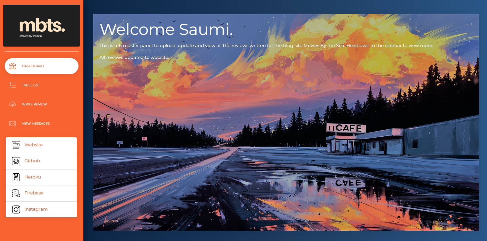
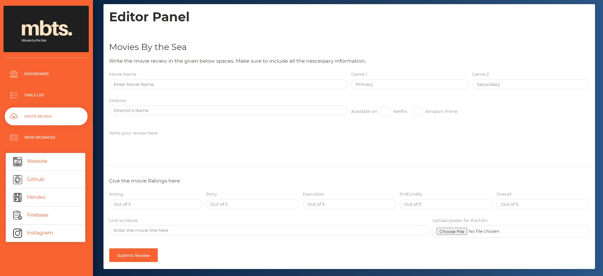

# Movies By the Sea - Control Panel

Master Panel to write and update reviews to the main website in realtime using Firebase realtime database and storage capabilities

## Test Scripts

**TEST_add** : Script to add the reviews from a JSON file (reviews.json) into the database. Assumed that JSON file already has the image links  
**TEST_api** : Script to test the APIs o get the movie details and eventually get the youtube links  
**TEST_image** : Script to get the image URL for the images uploaded to the storage  
**TEST_post** : Script to make an entry into the realtime database